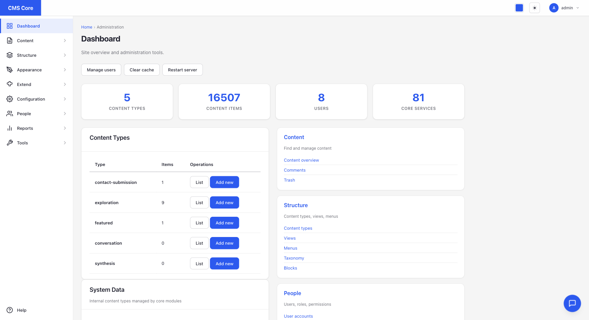
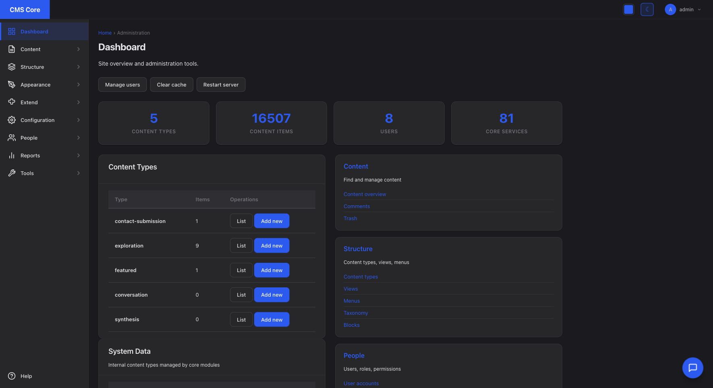

# cms-core

[](https://github.com/blackhole-technologies/cms-core/actions/workflows/ci.yml)
[](LICENSE)
[](package.json)

A Drupal-inspired CMS in TypeScript with **zero runtime dependencies in the
framework core**. Flat-file content storage, hook-based modules, native
TypeScript execution on Node 22+, ~95% feature parity with Drupal CMS.

## Project Status

🚧 **Pre-1.0, mid-port to TypeScript.** The framework is feature-complete and
in daily use; the TypeScript port is in flight. See the
[completion roadmap](docs/superpowers/specs/2026-04-17-cms-core-completion-roadmap-design.md)
and the [GitHub milestone](https://github.com/blackhole-technologies/cms-core/milestone/1)
for `1.0.0` progress.

| | |
|---|---|
| Version | `0.1.0` |
| Core services | 106 |
| Modules | 29 |
| CLI commands | 352+ |
| Drupal CMS parity | [95.2%](PARITY-REPORT-2026-02-21.md) |
| TypeScript port | ~61% (70 / 114 `core/` files) |

## Screenshots

<!-- Update once docs/screenshots/ has been populated in Phase 0 Task 0.1 -->

| Light mode | Dark mode |
|---|---|
|  |  |

## Quick Start

```bash
git clone https://github.com/blackhole-technologies/cms-core.git
cd cms-core
npm install
npm start                          # http://localhost:3001
node index.js help                 # list all 352+ CLI commands
node index.js modules:list         # show enabled modules
```

Default admin login: `admin` / `admin`. **Change `config/users.json` before
exposing to a network.**

## Technology

- **Runtime:** Node.js 22+ (ES modules, native TypeScript via strip-types)
- **Dependencies:** Zero in the framework core. Optional integrations:
  TipTap (`@tiptap/*`) for the rich-text editor, `sharp` for image processing.
- **Storage:** Flat-file JSON (with optional Postgres backend)
- **Server:** `node:http` (port 3001)
- **Architecture:** Service pattern (`init` / `register` exports), hook-based
  modules, plugin discovery

## Project Structure

```
cms-core/
├── index.js              # Entry point (server + CLI)
├── core/                 # 106 framework services (TypeScript port in flight)
├── modules/              # 29 feature modules
├── themes/               # Theme engine (layouts + skins) + SDC components
├── config/               # JSON configuration
├── content/              # Flat-file content storage (gitignored at runtime)
├── tests/                # node --test suite (unit, integration, browser)
├── docs/                 # Technical documentation
├── public/               # Static assets
└── .autoforge/           # Autonomous-coding harness state (gitignored)
```

## Core Features

- Content types with 21 field types, revision history, workflow state machine
- Media library with WYSIWYG editor and responsive images
- JSON:API, GraphQL, and REST endpoints
- Theme engine with layouts/skins separation, SDC components
- Token system with fallback chains
- AI provider system (Anthropic, OpenAI, Ollama; pluggable)
- Taxonomy, comments, search, i18n
- 352+ CLI commands

## Documentation

- [CMS Specification](docs/CMS-SPECIFICATION.md) — feature spec
- [Design System](docs/DESIGN-SYSTEM.md) — UX philosophy + tokens
- [Drupal Deep Dive](docs/DRUPAL-DEEP-DIVE.md) — parity baseline
- [JSON:API](docs/JSONAPI.md), [Media Library](docs/MEDIA-LIBRARY.md),
  [Layout Builder](docs/LAYOUT-BUILDER.md), [Editor](docs/EDITOR.md)
- [TypeScript port plan](docs/plans/2026-02-22-typescript-port.md)
- [Completion roadmap (current spec)](docs/superpowers/specs/2026-04-17-cms-core-completion-roadmap-design.md)

## Contributing

See [CONTRIBUTING.md](CONTRIBUTING.md) for dev setup, conventions, and PR
process. Report security issues per [SECURITY.md](SECURITY.md).

## Inspiration

`cms-core` is a from-scratch Node.js reimplementation of [Drupal CMS](https://new.drupal.org/drupal-cms)
patterns: entity API, field API, hook system, render arrays, layout builder,
Single-Directory Components, ECA (event-condition-action) automation, and
Webform. The [parity audit](PARITY-REPORT-2026-02-21.md) tracks coverage of
each Drupal CMS subsystem.

## License

[MIT](LICENSE).
